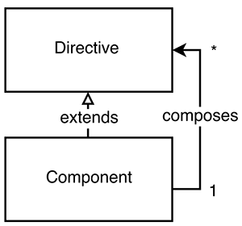
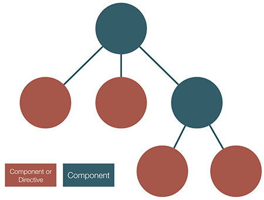
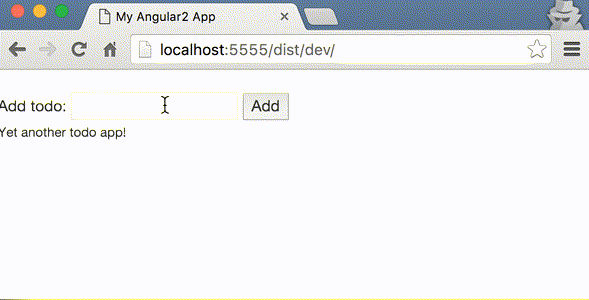

In this article I'm going to explain the difference between the **view children** and **content children** in Angular 2. Along the content we are also going to mention what is the difference between the properties `providers` and `viewProviders` of the `@Component` decorator.

You can find the source code of the current article at my [GitHub account](). So lets our journey begin!

## Composing primitives

First of all, lets clarify the relation between the **component** and **directive** concepts in Angular 2. A typical design pattern for developing user interface is the [composite pattern](https://en.wikipedia.org/wiki/Composite_pattern). It allows us to compose different primitives and treat them the same way we can treat a single instance of these primitives. In the world of functional programming we can compose functions. For instance:

```haskell
map ((*2).(+1)) [1, 2, 3]
-- [4,6,8]
```
The Haskell code above we compose the functions `(*2)` and `(+1)` so that to each item *n* in the list will be applied the following sequence of operations `(n + 1) * 2`.

### Composition in the UI

Well, in the user interface it is actually quite similar. We can think of the individual component as functions. These functions can be composed in order to make more complex functions.

We can illustrate this graphically by the following structural diagram:



The the figure above we have two elements:

- `Directive` - A self-contained elements which hold some logic, but do not contain any structure.
- `Component` - An element, which specifies the `Directive` element and holds a list of other `Directives` (which could be components since `Component` extends `Directive`).

This means that using the preceding abstraction we can build structures of the following form:



On the above figure we can see a hierarchical structure of components and directives. The leaf components on the diagram are either directives or components that don't hold reference any other components or directives.

## Composition of Components in Angular 2

Now, in order to be more specific, lets switch to the context of Angular 2.

We can build a sample application which helps us illustrates the concepts that we are going to talk about better. Lets define the following `TodoCmp` component:

```ts
@Component({
  selector: 'todo-app',
  providers: [TodoList],
  directives: [TodoCmp, TodoInputCmp],
  template: `
    <section>
      Add todo:
      <todo-input (onTodo)="addTodo($event)"></todo-input>
    </section>
    <section>
      <h4 *ngIf="todos.getAll().length">Todo list</h4>
      <todo *ngFor="var todo of todos.getAll()" [todo]="todo">
      </todo>
    </section>
    <ng-content select="footer"></ng-content>
  `
})
class TodoAppCmp {
  constructor(private todos: TodoList) {}
  addTodo(todo) {
    this.todos.add(todo);
  }
}
```

Yes, this is going to be "Yet another MV* todo application". Above we define a component with selector `todo-app` which has an inline template, and defines a set of directives that it or any of its child components is going to use.

We can use the component in the following way:

```html
<todo-app></todo-app>
```

Between the opening and closing tags of the `todo-app` element we can put some content:

```html
<todo-app>
  <footer>
    Yet another todo app!
  </footer>
</todo-app>
```

Notice the last element in the template declaration of the todo component: `<ng-content select="footer"></ng-content>`.
With `ng-content` we can grab the content between the opening and closing tag of the `todo-app` element and project it somewhere inside of the template! For instance in the example above, the `footer` will be injected at the bottom of the rendered todo component.

We can also skip the `select` attribute of the `ng-content` element. In this case we will project the entire content passed between the opening and closing tags on the place of the `ng-content` element.

The end result of the application will be as follows:



### ViewChildren and ContentChildren

And yes, it was that easy! Now we already can define what **view children** and **content children** are. The children element which are directly composed by given component inside of its template are called **view children**. On the other hand, elements which are put between the opening and closing tags of the host element of given component are called **content children**.

This means that `todo-input` and `todo` could be considered view children of `todo-app`, and `footer` could be considered a content child.

#### Accessing View and Content Children

Now comes the interesting part! Lets see how we can access and manipulate these two types of children!

##### Playing around with View Children

Angular 2 provides the following property decorators: `ViewChildren`, `ViewChild`, `ContentChildren` and `ContentChild`. We can use them the following way:

```ts
@Component({
  selector: 'todo-app',
  providers: [TodoList],
  directives: [TodoCmp, TodoInputCmp],
  template: `...`
})
class TodoAppCmp {
  @ViewChild(TodoInputCmp)
  inputComponent: TodoInputCmp
  @ViewChildren(TodoCmp)
  todoComponents: QueryList<TodoCmp>;

  constructor(private todos: TodoList) {}
  ngAfterViewInit() {
    // available here
  }
}
```

The example above shows how we can take advantage of `ViewChildren` and `ViewChild`. Basically we can decorate a property and this way query the view of an element. In the example above we query the `TodoInputCmp` with `@ViewChild` and `TodoCmp` with `@ViewChildren`. We use different decorators since we have only a single input, so we can grab it with `@ViewChild` but we have multiple todo items rendered, so for them we need to apply the `@ViewChildren` decorator.

Another thing to notice are the types of the `inputComponent` and `todoComponents` properties.

The first property is of type `TodoInputCmp`, it can be either with value `null` if Angular haven't found such child or with value reference to the instance of the component's controller (in this case, reference to an instance of the `TodoInputCmp` class). On the other hand, since we have multiple `TodoCmp` instances which can be dynamically rendered, the type of the `todoComponents` property is `QueryList<TodoCmp>`. We can think of the `QueryList` as an observable collection, which can throw events once items are added or removed from it.

**Since Angular's DOM compiler will process the `todo-app` component before its children, during the instantiation of the `todo-app` component the `inputComponent` and `todosComponen` properties will not be initialized. Their values are going to be set in the `ngAfterViewInit` life-cycle hook**.

##### Accessing Content Children

Almost the same rules are valid for the element's content children, however, there are some slight differences. In order to illustrate them better, lets take a look at the root component which uses the `TodoAppCmp`:

```ts
@Component({
  selector: 'footer',
  template: '<ng-content></ng-content>'
})
class Footer {}

@Component(...)
class TodoAppCmp {...}

@Component({
  selector: 'app',
  styles: [
    'todo-app { margin-top: 20px; margin-left: 20px; }'
  ],
  template: `
    <content>
      <todo-app>
        <footer>
          <small>Yet another todo app!</small>
        </footer>
      </todo-app>
    </content>
  `,
  directives: [TodoAppCmp, NgModel, Footer]
})
export class AppCmp {}
```

