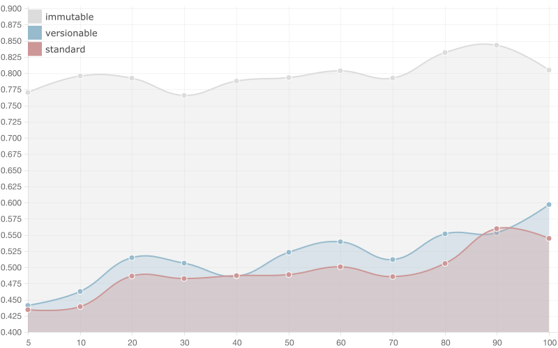
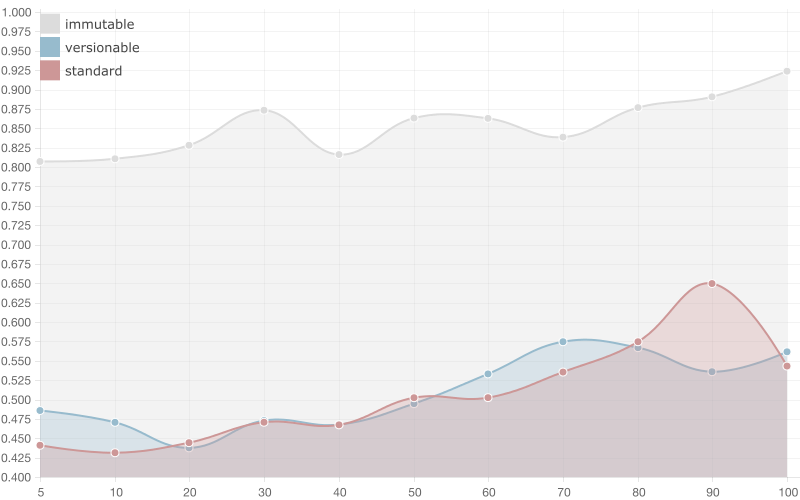
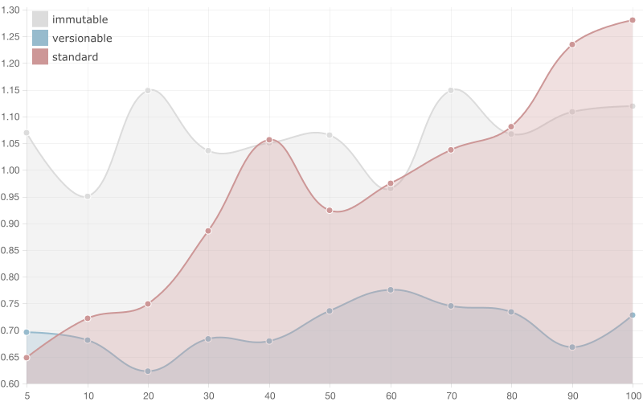
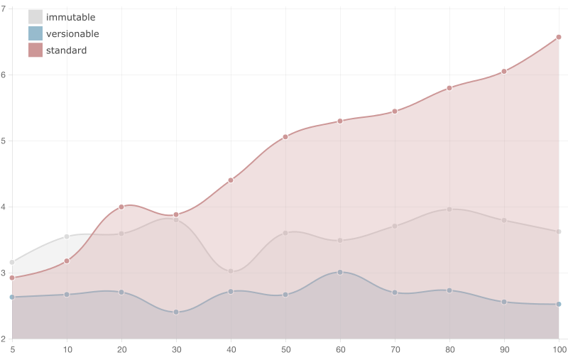
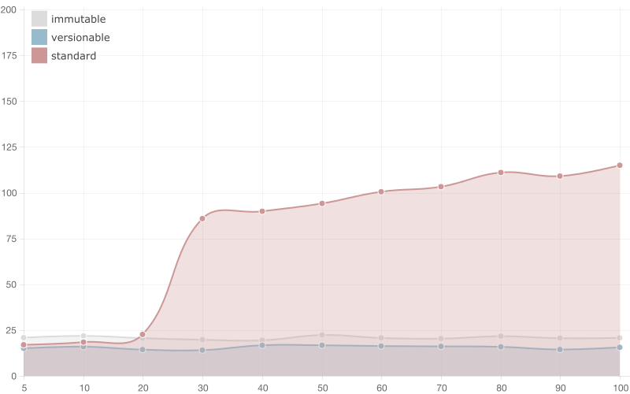

This is the last post of the series "Boost the Performance of an AngularJS Application Using Immutable Data". I strongly recommend you to take a look at the previous two parts before continue reading this content. You can find them at:
- [Part 1](http://blog.mgechev.com/2015/03/02/immutability-in-angularjs-immutablejs/)
- [Part 2](http://blog.mgechev.com/2015/04/11/immutability-in-angularjs-immutablejs-part-2/)

## Introduction

Before about a month ago, I decided to experiment using immutable data structures in an AngularJS application. The goal behind my decision was quite simple - optimization of the `$digest` loop. How immutability could help? Immutable data cannot change after being created. The execution of each operation, which changes the immutable collection (add, delete, set) will create of a new data structure but will leave the initial data unchanged. This way we know that a watched expression, which evaluation results a collection, have changed if and only if its current reference differs from the previous one. This speeds up the change detection of the expression from `O(n)` to `O(1)`, i.e. instead of watching collection with `$watchCollection(expr, fn)`, we can afford `$watch(expr, fn, false)`, instead.

So far so good, but creation of a new data structure will have two major performance impacts:

- Copying the initial collection and making the change, before "freezing it".
- <strike>More work for the garbage collector.</strike>

As we saw from "[Boost the Performance of an AngularJS Application Using Immutable Data - Part 2](http://blog.mgechev.com/2015/04/11/immutability-in-angularjs-immutablejs-part-2/)", the second is not such a big concern but copying the entire data structure slows us down significantly.

## Optimization Options

In order to reduce the complexity of the code, which dirty checks the expression, from `O(n)` to something quite close to `O(1)`, we have two main options:

- Use `$watch(expr, fn, false)` - This way AngularJS will check for equality with `===`, which is an operation with constant complexity.
- Use `$watchCollection(expr, fn)` but reduce its running time. This means that we need to decrease the elements over which `$watchCollection` iterates.

### $watch

The only way to take advantage of the first option is by receiving a new reference to the data structure once it changes or watch an internal property, which indicates a change. Unfortunately, we cannot change the value of the reference. What we can do is to create a wrapper of the native JavaScript collection and on each change to create a new wrapper, without copying the collection, i.e.:


let primitive = [1, 2, 3];
let list = new ListWrapper(primitive);
let changedList = list.append(4);
console.log(primitive === changedList); // false
// The primitive collection is changed
console.log(primitive); // [1, 2, 3, 4]


But this will also have one more side effect:


console.log(list.toJS()); // [ 1, 2, 3, 4]
console.log(changedList.toJS()); // [ 1, 2, 3, 4]


Keeping the same reference to the primitive list in both collection will cause change inside the underlaying data in both collections. This solution looks like a dirty hack.

### $watchCollection

How we can reduce the keys over which AngularJS' dirty checker iterates? If we have a collection with 100,000,000 items, how to make AngularJS iterates only over a few of them in order to detect if the collection has changes? We will definitely need a wrapper but how to do the optimization?

AngularJS does not need to iterate over the entire collection but only needs to check a control flag, which shows the change in the collection. What we can do is to have a wrapper, which keeps a reference to a standard JavaScript array. All operations over the wrapper will be forwarded to the array but the ones, which change the collection, will update the control flag, with a new value. On the next iteration of the `$digest` loop, AngularJS will check only the control flag and if it differs from its previous value the callbacks associated with the expression will be invoked.

But how we can limit AngularJS to watch **only** the control flag? We can do something like:


$watch(() => {
  return collection.isChanged;
}, cb, false);


There are three drawbacks of this approach:

- We expose underlaying implementation details to the user of our library.
- AngularJS needs to reset the `isChanged` flag once it detects a change. This requires changes in the AngularJS watch mechanism.
- We can change `isChanged` outside the collection.

Lets take a look at AngularJS' `$watchCollection` implementation:


// ...
for (key in newValue) {
  if (newValue.hasOwnProperty(key)) {
    newLength++;
    newItem = newValue[key];
    oldItem = oldValue[key];

    if (key in oldValue) {
      bothNaN = (oldItem !== oldItem) && (newItem !== newItem);
      if (!bothNaN && (oldItem !== newItem)) {
        changeDetected++;
        oldValue[key] = newItem;
      }
    } else {
      oldLength++;
      oldValue[key] = newItem;
      changeDetected++;
    }
  }
}
// ...


This part of the implementation is invoked, when the watched collection is not array-like. What we notice is that AngularJS iterates over the keys using `for-in`. In order to achieve complexity around `O(1)`, we need to decrease the amount of keys over, which AngularJS will iterate and possibly leave only the change control flag as only key of the collection' instances.

Here is how we achieve behavior result:


function defineProperty(obj, name, descriptor) {
  'use strict’;
  Object.defineProperty(obj, name, descriptor);
}

function defineMethod(obj, name, method) {
  'use strict’;
  defineProperty(obj, name, {
    enumerable: false,
    value: method
  });
}

function VersionableList(list) {
  'use strict’;
  this._version = 0;
  Object.defineProperty(this, '_data', {
    enumerable: false,
    value: list || []
  });
}

'push pop shift unshift'.split(' ')
.forEach(function (key) {
  'use strict';
  defineMethod(VersionableList.prototype, key, function () {
    this._data[key].apply(this._data, arguments);
    this._updateVersion();
  });
});
defineMethod(VersionableList.prototype, 'set', function (idx, val) {
  this._data[idx] = val;
  this._updateVersion();
});


There are three main parts of the snippet above:

- The way we take advantage of non-enumerable properties
- The enumerable `_version` property
- The way we update the version of the list once it has mutated

The update method does not have to do something complex, it can only increment the version property.

## Benchmark Results

I compared the performance of `VersionableList` versus Immutable.js list and the built-in JavaScript arrays with the following variables in mind:

- Collection Size
- Bindings Count

For running the benchmarks and visualizing the results in charts, I used [benchpress](https://github.com/angular/angular/tree/master/modules/benchpress) with a custom data formatter. The code for the benchmarks could be found [here](https://github.com/mgechev/benchpress-angularjs-immutable).

We can explore the results in the following sections. The x-axis shows the bindings count and the y-axis shows the running time.

### 5 entries

The two big competitors in this benchmark are the `VersionableList` and the native JavaScript array. As we see the built-in JavaScript list performs just a little bit better than `VersionableList`. Immutable.js list is slower because of the overhead caused by copying the entire data structure on change.

### 10 entries

When having a data structure with 10 items the built-in JavaScript array and `VersionableList` have almost the same performance.

### 100 entries

The kicking-ass winner in this benchmark is the `VersionableList`. With higher amount of bindings, the immutable list performs better than the built-in JavaScript array.

### 1,000 entries

With 1k collection size the immutable list performs better than the built-in JavaScript array and is with almost constant running time (the bindings almost don't impact the running time, since they have constant complexity). The `VersionableList` performs even better since it doesn't require copying of the collection on change.

### 10,000 entries

The supreme champion is the `VersionableList`. The interesting fact here is that the immutable list performs just slightly worst than the `VersionableList` list, although on each change a new collection with 10,000 items is created.

## Further Optimization

There's no way to go much further without making any optimizations in the AngularJS' internal change detection. We may gain slight performance improvement if AngularJS doesn't invoke `hasOwnProperty` in the `$watchCollection` dirty checking strategy, since the poor performance of the method. This will require us to change `VersionableList` to something "array-like" in order to enter [the second case of `$watchCollection`'s interceptor](https://github.com/angular/angular.js/blob/master/src/ng/rootScope.js#L575-L601).

## Conclusion

Using Immutable data we can gain performance improvements in the running time of our AngularJS application. By workarounding the biggest drawback of using immutable data - copying the entire data structure on change, we can reduce the running time even further. In both cases we should keep in mind that Immutable.js and VersionableCollections are both only wrappers around the standard collections. If you make any change in the collection items, AngularJS will not detect any change in the collection, which on their other hand won't force update of your view.

